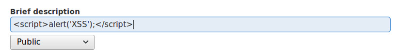
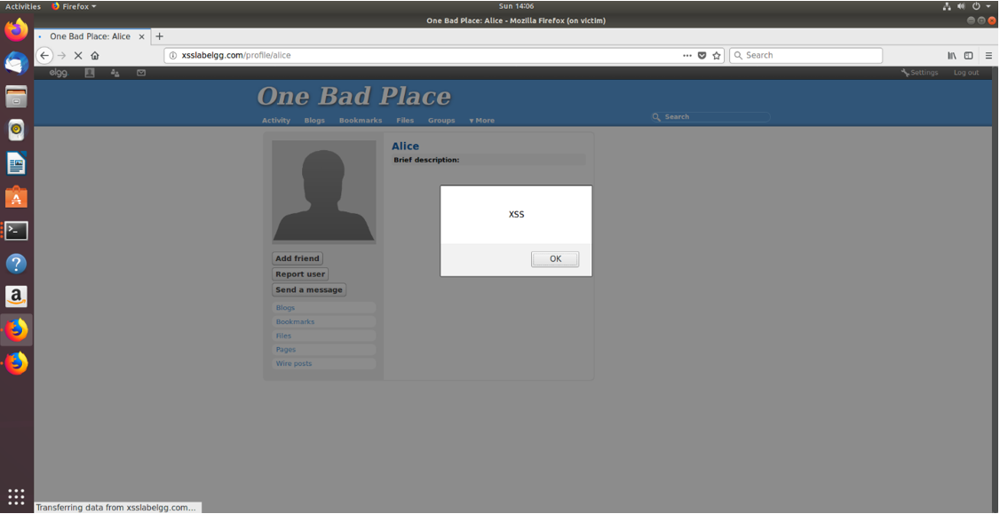
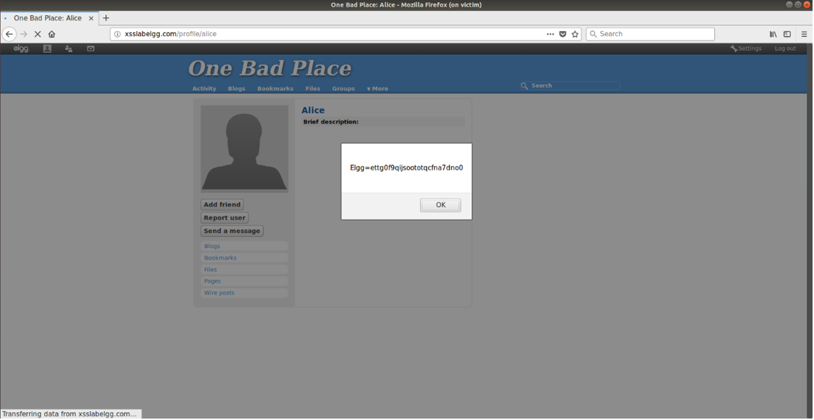
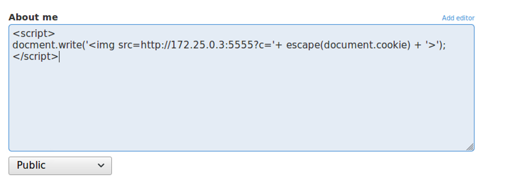
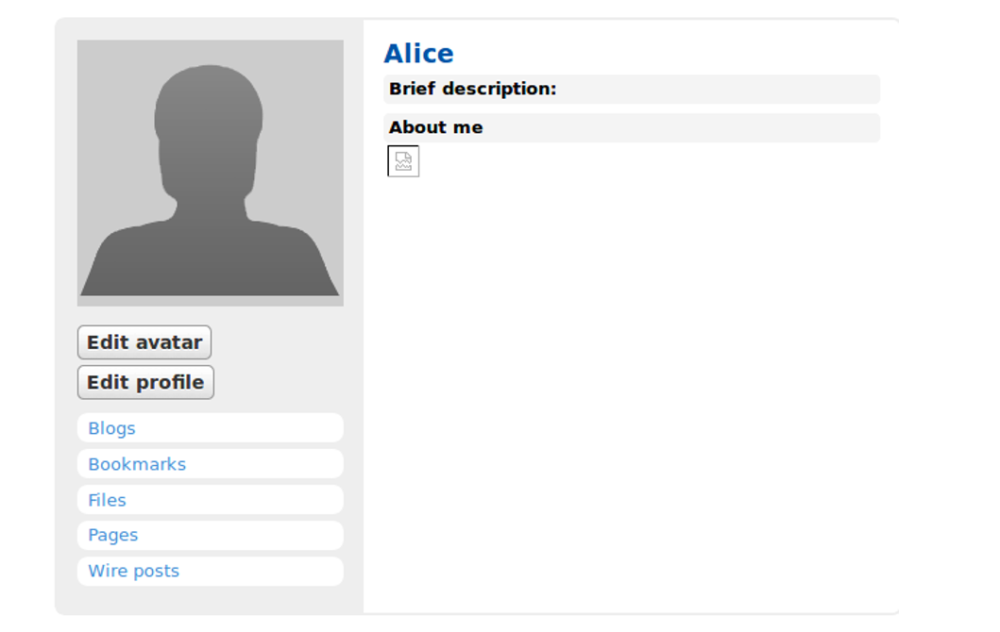
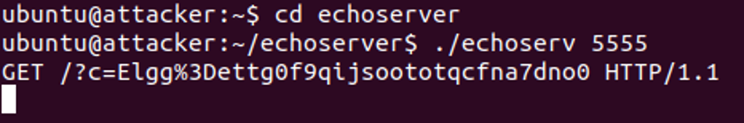
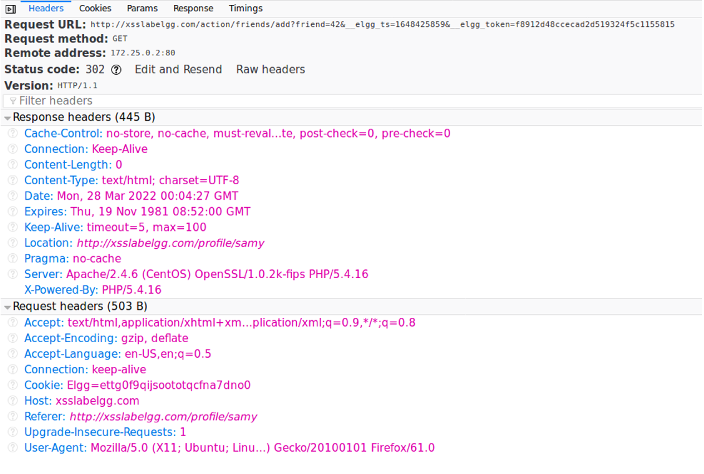
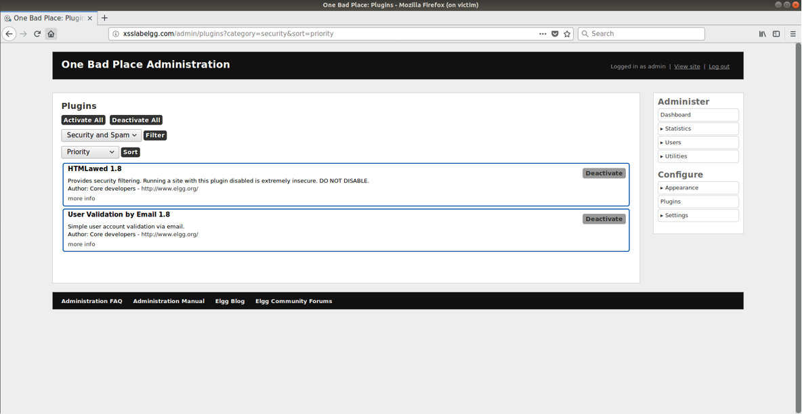
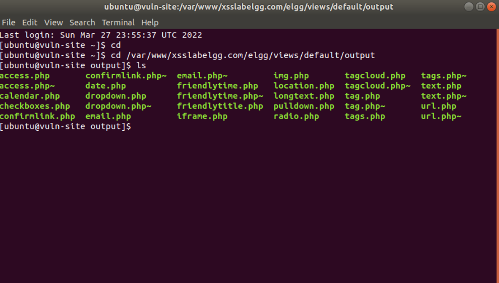
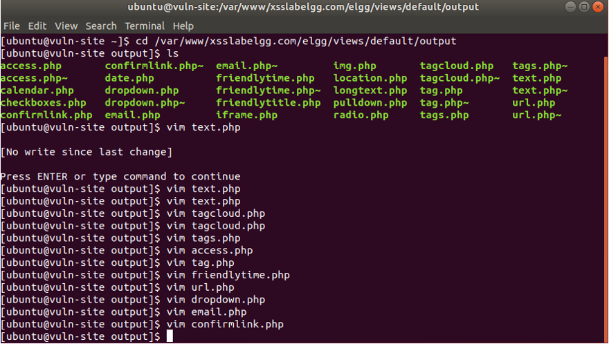

# Disclaimer

The following work was done using virutal machines and a fake social media website. The exploits shown here should never be used against a website you do not have permission to modify or test (besides, nowadays, this is pretty much patched everywhere).

# Introduction

Cross-site scripting is a way for attackers to steal information through some of the subtlest of means. What seems to be a regular text box on a website can turn into a vehicle for malicious code that attackers can use to harass people, or even steal their identities. This lab will first demonstrate the dangers of XSS by showing the huge effect one infected profile can have on a social media platform and then provide some potential countermeasures.

# Procedure

## Preparing the Lab Environment

Like the previous lab, I prepare for the lab by formatting the lab template and launching VirtualBox. From there, I sign onto the virtual machine I made for this lab and use the terminal that pops up on launch to access the lab. I do so by typing “labtainer xsite”. After a few moments, three terminal windows pop up and the lab begins.

## Posting a Malicious Message to Display an Alert Window

A classic usage of XSS is to enter JavaScript into a text box to display a popup window to anyone who visits the page. If input is not flushed after being entered, this can happen continuously. In this section, I will be doing this by injecting code into the “Brief Description” field in the profile editing page.

First, I open Firefox on the attacking computer and access the lab’s Elgg site. For this lab, the “Alice” account will be my attacking account. After logging in, I enter the JavaScript code for the alert window in the” Brief Description” field. The feedback is immediate as the instant I save my changes and return to the profile’s page, I am greeted by the alert window.

-_Figure 1_: 

JavaScript being injected into the “Brief description” field. In doing so, I am taking advantage of the site’s usage of HTML and how it is treating my input as data when it should be treated as text.

  

From there, I switch to the victim’s computer and run its instance of Firefox and open Elgg. Then, I log into the “Boby” account which will act as my victim. I then open the “members” page and am surprised that the alert box appeared there. This leads me to believe that the injected code can affect other users if the poisoned profile is even so much as linked on a page. Then, of course, after visiting Alice’s page, I receive the popup window again.

-_Figure 2_: The popup window from Boby’s point of view. Notice that the window’s text is the same as that in between the quotation marks in the code. Any time Alice’s account is visited or even linked, this message will appear.

  

## Posting a Malicious Message to Display Cookies

Building off the previous task, the aim here is to make the injected code slightly more dangerous by making it display the user’s cookies. To do so, I switch back to the attacker computer and edit Alice’s profile again. This time, rather than entering text, I will use a pre-existing method that calls the value for the user’s cookies.

-_Figure 3_: The modified JavaScript. This time, the input for the alert is populated by the document property, “cookie”. This means that the value for the user’s cookies will first be called, then displayed in the alert window.

  

With this in place, I return to Alice’s profile page, and the cookies for Alice are shown in the window. Likewise, after returning to Boby’s account, I open Alice’s page and see the same alert window, but with a different value.

-_Figure 4_: Boby’s cookies in the popup window. It seems that the cookie that is called is one that is specifically for Elgg.

  

Interestingly, this effect stays through the duration of the lab and affects everyone, even the admin account. Though this may seem scary at first glance, it is overall harmless since only the user can see his or her cookies. This information cannot be shared. However, there is a way to work around this as is discussed in the next task.

##  Stealing Cookies from the Victim's Machine

Although they can be frightening, and potentially annoying, the actions done in the first two tasks are overall harmless. On the other hand, this task demonstrates how quickly, and easily, cross-site scripting can become an incredible threat. I had shown, in the previous task, how a user’s cookies can be brought up. This task is about how that information can be redirected and stolen by an attacker. Recalling knowledge about HTML, a developer can use the  tag to add an image to a website and add a source URL if it comes from another domain. In a similar way, the attacker is going to steal the victim’s cookies by adding a fake image with the source being the attacker’s IP address. In doing so, the attacker can steal the victim’s cookies through an HTTP GET packet.

To begin, I use the attacker’s computer and access Alice’s page. I then go to the editing page, where the previous JavaScript was embedded, and use the “About Me” window to inject a larger script. First, however, I had to click the “remove editor” option to disable the WYSIWYG editor and instead use plain text. From there, I enter my script into the field.

-_Figure 5_: The code injected into the “About me” window. The code here is making a fake image with the source being the attacker’s IP address. When the image is called, the website goes to the source address and sends a request packet to retrieve the necessary data. This code, however, modifies this process so that the target user’s cookies are brought along in the request. This packet will be fed into the attacker’s computer in port 5555.

  

After implementing the code and saving the changes, Alice’s profile now looks like this:

-_Figure 6_: Alice’s profile with the dummy image. When an unfortunate user access Alice’s page and sees that failed image request, the attacker will already have stolen the user’s cookies.

  

As mentioned, this stolen information will be fed into the attacker’s port 5555. The attacker’s computer is equipped with “echoservers” which acts as a port listener. After using “cd echoservers” to access the directory, I enter the command “./echoserv 5555”. The “./” tells the computer to launch the program in the current directory (which is needed for any program not in the “root” directory), and “echoserv 5555” directs echoserver to listen for traffic in port 5555. Nothing happens at first, but this is because the listener is running, but is waiting for traffic.

Then, back to Boby’s account, I access Alice’s profile again and view the broken image. Now, returning to the attacker’s port listener, I see this output:

-_Figure 7_: The output from echoserver after Boby visits Alice’s page. Shown in the final line is the GET request that the script from before specified. Shown after “/?c” is Boby’s cookie value. Notice how this value is the same as the one shown in Figure 4. However, the “=” is replaced by “%3D”.

  

With this done, the attacker can now assume Boby’s identity and do things on his behalf. The next task will show how the hacker can control the friends Boby adds.

## Session Hijacking and Using Stolen Cookies

With possession of the victim’s cookies, the attacker can now do all sorts of activities on the victim’s profile while making it look like it was the victim all along. I think this is comparable to identity theft. So now, with access to Boby’s profile, I will send a forged HTTP request using Boby’s cookies to add a friend on his behalf. My objective here is to add Samy to Boby’s friends list. Although not very practical, the method that worked for me was using Boby to add Samy, capturing the network traffic, removing Samy, then using the attacker’s computer to generate the forging program.

First, as Boby, I visit Samy’s profile. Then, using Firefox’s developer tools, I open the “Network” panel and refresh the page. Shortly after, I add Samy as a friend and capture the information in the new packet that appears.

-_Figure 8_: The request header when adding Samy as Boby. The main point of interest here is the request URL at the very top. There, I can see the values for the “tn” and “token” fields in addition to the friend GUID for Samy (42).

  

With this information, I can now head over to the attacker’s computer and access the HTTPSimpleForge program template. Using the information above, I enter the necessary information for the “tn”, “token”, “friendGUID”, and “cookies” fields.

-_Figure 9_: The completed HTTPSimpleForge program. Again, notice that the value for the cookies is the exact same as Boby’s, and the information from the previous figure can be found near the top of the page. This program will generate a forged HTTP request by assembling a URL identical to Boby’s initial request and adding his cookies as the sender. In doing so, I can add Samy to Boby’s account while making it look like he was the one who sent the request.

  

I edit the program using vim, and after compiling and running the program, I am greeted with a wall of HTML code presumably from my target webpage. Once this is done, I return to Boby’s account and check the “activities” panel. Sure enough, the history shows that Samy has indeed been added again.

-_Figure 10_: Samy being friended twice. The first time (the bottom one) is the request that I sent as Boby. The second entry appeared after I ran my program.

  

Cross-site scripting has proven to be a significant threat. Luckily, in modern cyber security, there are many countermeasures that administrators can use to protect their websites and networks.

# Countermeasures

This lab, so far, has shown the chaos that can arise when users and their inputs are left unchecked. Fortunately, this is not usually the case as there are administrators who regularly maintain and moderate their domains. For this final task, I will be assuming the identity of one of Elgg’s administrators and attempt to counteract the havoc I caused as the attacker. First, I log into the administrator’s account and notice that there is a new link, “Administrator,” that is visible. Upon clicking it, I am directed to the admin’s control panel. From there, I locate and activate the plugin “HTMLawed 1.8”.

-_Figure 11_: The administrator’s control panel. Shown here are the plugins that counteract spam and presumably work against cross-site scripting. HTMLawed 1.8, for instance, provides enhanced security filtering and validates user input.

  

However, even after enabling this plugin, I did not see much of an improvement as the popups and vulnerabilities were still present. To help with this, I will be modifying some of the PHP files in the server’s settings to encode special HTML characters. In doing so, I can hopefully break the execution of injected code. To do so, I open the “vuln-site” terminal and go to the “output” directory as specified in the directions. From there, I am met with various PHP files that configure the output of the site.

-_Figure 12_: The output PHP files. Shown here are the files I will be modifying to enable the “htmlspecialchars” countermeasure.

  

Like the HTTPSimpleForge program, I will be using vim to comment (or uncomment) lines of code to enable “htmlspecialchars”. However, these are important files, and are therefore marked as “read only.” This means that changes that I make to these files will not normally be saved. However, after I exit the editing mode, I can use the command “w !sudo tee %” to override the permissions of the files and write them regardless. Shown below is the terminal output after all the necessary files were modified.

-_Figure 13_: The “output” directory again, with multiple entries of vim editing. Each entry is an instance where I modified the PHP file so as to enable “htmlspecialchars”.

  

Finally, with this additional countermeasure in place, I again navigate the website to see if the cookie-snatching code is still functional on Alice’s page. After opening it, I find that injected code has been converted to plain text and the image script is no longer functioning.

-_Figure 14_: Alice’s page after the countermeasures were activated. Notice that the fields where I injected the JavaScript now only display them in plain text. This means that text boxes can no longer be used as means to execute code. I suspect this because the special characters, particularly < and >, have been encoded so that they are read differently and therefore render the scripts useless.

  

With this final step completed, the lab comes to a close.

# Conclusion

This lab did well to demonstrate how cross-site scripting works and why it is considered such a prominent threat in the cyber security world. If input is not treated properly, a savvy JavaScript hacker could inject code that could do anything ranging from annoying site visitors to stealing their information. The countermeasures are also interesting as they show that the two best ways to prevent cross-site scripting is to filter inputs and encode special characters so that they cannot be interpreted as parts of code. However, I do have to admit that this lab was not without limitations. First, I was never able to make the alert window go away. Even after disabling the JavaScript on the infected profile, a window showing the user’s cookies would still display. Though this is harmless, it is still annoying. Secondly, the part where I forged an HTTP request is rather unrealistic since it implies that Boby would have to cooperate with the attacker and provide the network information he captured. Lastly, I found this lab to be extremely difficult. There were many times where the directions where vague or difficult to follow and crucial information was left out. For instance, in Task 4, I think the fact that the “ts” and “token” values change each time a request was sent really should have been mentioned. Moreover, the formatting (spacing) in the HTTPSimpleForge program was off and would interfere with getting the desired results. Nevertheless, I still found this to be a very practical lab that clearly demonstrates the properties and dangers of cross-site scripting.

